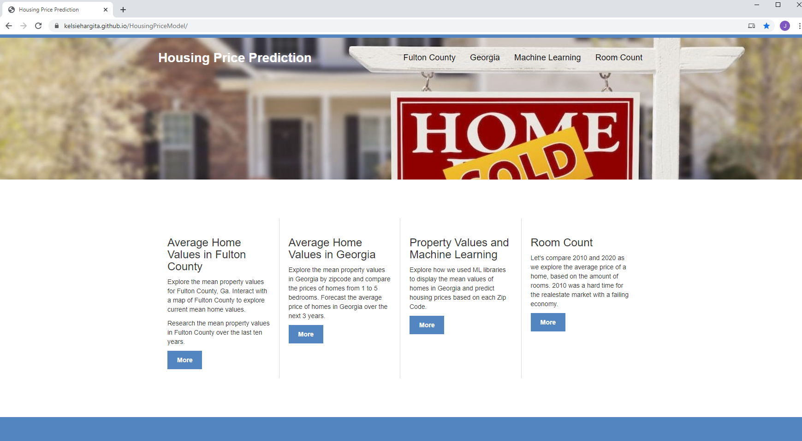

# Housing Price Model

## Using Historical Housing Values provided by Zillow.com

 
This project combines JavaScript, D3.js, Plotly.js, HTML to explore the mean property values for Fulton County, Ga. Interact with a map of Fulton County to explore current mean home values.
 
Research the mean property values in Fulton County over the last ten years.
  

The Housing Prince Model site can be found here: 

https://kelsiehargita.github.io/HousingPriceModel/

## The Housing Price Model site breaks the analysis into the sections below
 

### The Fulton County tab 

- Explore the mean property values for Fulton County, Ga. Interact with a map of Fulton County to explore current mean home values.

- Research the mean property values in Fulton County over the last ten years.

### The Georgia tab

- Explore the mean property values in Georgia by zipcode and compare the prices of homes from 1 to 5 bedrooms. 
- Forecast the average price of homes in Georgia over the next 3 years.

### The Machine Learning tab

- Explore how we used ML libraries to display the mean values of homes in Georgia and predict housing prices based on each Zip Code.

### The Room Count tab

- Let's compare 2010 and 2020 as we explore the average price of a home, based on the amount of rooms. 
- 2010 was a hard time for the realestate market with a failing economy

